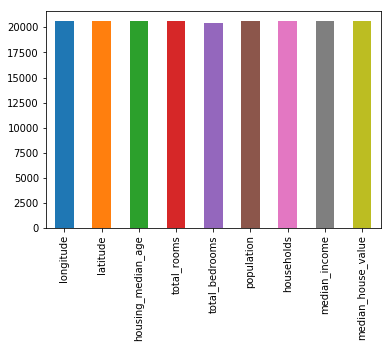
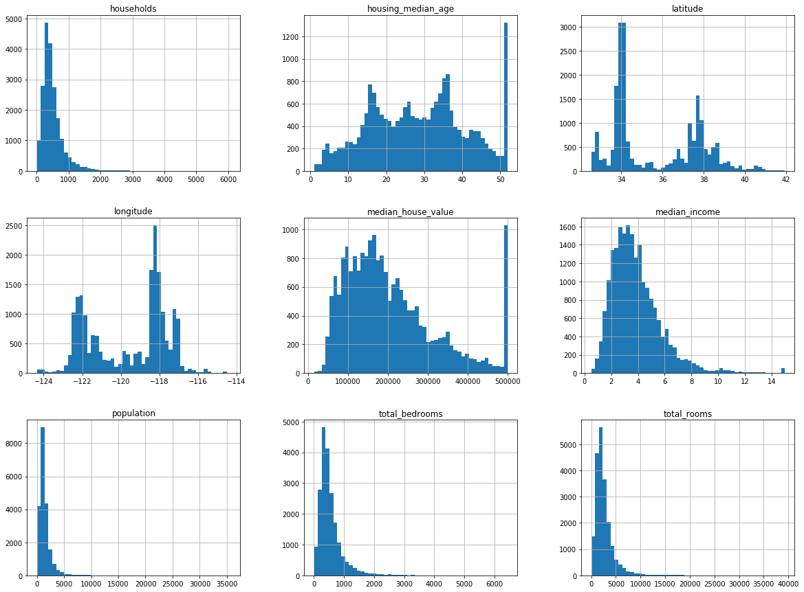
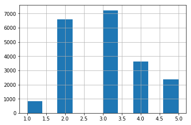
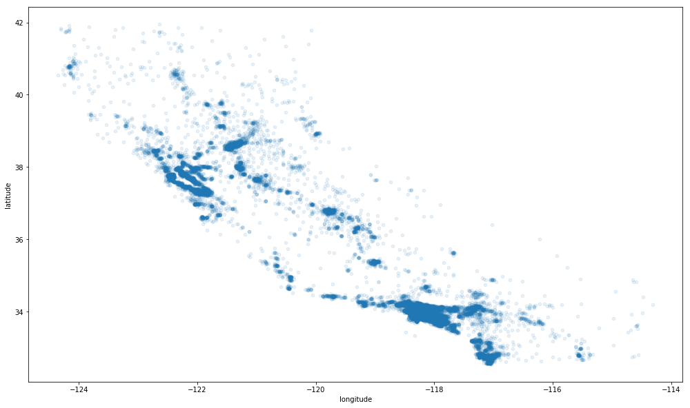
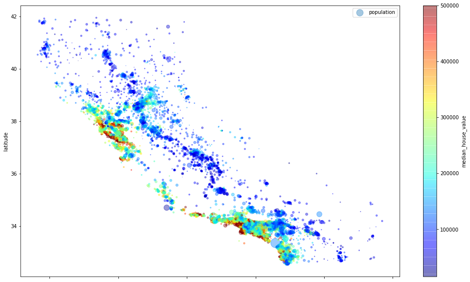
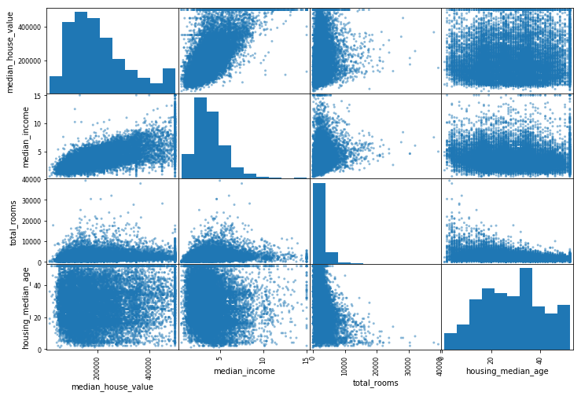
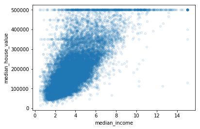

```python
import os
import tarfile
from six.moves import urllib
```

### Download and unzip


```python
DOWNLOAD_ROOT = 'https://raw.githubusercontent.com/ageron/handson-ml/master/'
HOUSING_PATH = 'datasets/housing'
HOUSING_URL = DOWNLOAD_ROOT + HOUSING_PATH + '/housing.tgz'
```


```python
def fetch_housing_data(housing_url=HOUSING_URL, housing_path = HOUSING_PATH):
    housing_url=HOUSING_URL
    housing_path = HOUSING_PATH
    if not os.path.isdir(housing_path):
        os.makedirs(housing_path)
    tgz_path = os.path.join(housing_path, 'housing.tgz')
    urllib.request.urlretrieve(housing_url,tgz_path)
    housing_tgz=tarfile.open(tgz_path)
    housing_tgz.extractall(path=housing_path)
    housing_tgz.close()

```


```python
fetch_housing_data()
```

### Load data


```python
import pandas as pd

def load_housing_data(housing_path=HOUSING_PATH):
    csv_path=os.path.join(housing_path,'housing.csv')
    return pd.read_csv(csv_path)
```


```python
housing=load_housing_data()
```


```python
housing.info()
```

    <class 'pandas.core.frame.DataFrame'>
    RangeIndex: 20640 entries, 0 to 20639
    Data columns (total 10 columns):
    longitude             20640 non-null float64
    latitude              20640 non-null float64
    housing_median_age    20640 non-null float64
    total_rooms           20640 non-null float64
    total_bedrooms        20433 non-null float64
    population            20640 non-null float64
    households            20640 non-null float64
    median_income         20640 non-null float64
    median_house_value    20640 non-null float64
    ocean_proximity       20640 non-null object
    dtypes: float64(9), object(1)
    memory usage: 1.6+ MB
    

### NA value count according to columns

almost no na values


```python
housing.describe().loc['count'].plot(kind='bar')
```


    <matplotlib.axes._subplots.AxesSubplot at 0x1aad1076da0>





almost no columns have high NA values

### count oceanproximity value


```python
housing['ocean_proximity'].value_counts()
```


    <1H OCEAN     9136
    INLAND        6551
    NEAR OCEAN    2658
    NEAR BAY      2290
    ISLAND           5
    Name: ocean_proximity, dtype: int64


```python
%matplotlib inline
import matplotlib.pyplot as plt
```


```python
housing.hist(bins=50, figsize=(20,15))
```


    array([[<matplotlib.axes._subplots.AxesSubplot object at 0x000001AAD33A2860>,
            <matplotlib.axes._subplots.AxesSubplot object at 0x000001AAD10EBE80>,
            <matplotlib.axes._subplots.AxesSubplot object at 0x000001AAD110DB00>],
           [<matplotlib.axes._subplots.AxesSubplot object at 0x000001AAD1133860>,
            <matplotlib.axes._subplots.AxesSubplot object at 0x000001AAD1159320>,
            <matplotlib.axes._subplots.AxesSubplot object at 0x000001AAD3525A20>],
           [<matplotlib.axes._subplots.AxesSubplot object at 0x000001AAD3549780>,
            <matplotlib.axes._subplots.AxesSubplot object at 0x000001AAD35BE240>,
            <matplotlib.axes._subplots.AxesSubplot object at 0x000001AAD35E4320>]],
          dtype=object)





some columns have cap, so to analyze better we have to becareful this value
<font color='red'>Solution </font>
1. Collect proper labels for the districts whose labels were capped.
2. Remove those districts from the training set (and also from the test set, since your system
should not be evaluated poorly if it predicts values beyond $500,000).


```python
import hashlib
def test_set_check(identifier, test_ratio, hash):
    return hash(np.int64(identifier)).digest()[-1] < 256 * test_ratio  ##  example )  true false true false false...return 
```


```python
def split_train_test_by_id(data, test_ratio, id_column, hash=hashlib.md5):
    ids=data[id_column]
    in_test_set=ids.apply(lambda id_: test_set_check(id_, test_ratio,hash))
    return data.loc[~in_test_set], data.loc[in_test_set]
```


```python
housing_with_id
```


<div>
<style scoped>
    .dataframe tbody tr th:only-of-type {
        vertical-align: middle;
    }

    .dataframe tbody tr th {
        vertical-align: top;
    }

    .dataframe thead th {
        text-align: right;
    }
</style>
<table border="1" class="dataframe">
  <thead>
    <tr style="text-align: right;">
      <th></th>
      <th>index</th>
      <th>longitude</th>
      <th>latitude</th>
      <th>housing_median_age</th>
      <th>total_rooms</th>
      <th>total_bedrooms</th>
      <th>population</th>
      <th>households</th>
      <th>median_income</th>
      <th>median_house_value</th>
      <th>ocean_proximity</th>
      <th>id</th>
    </tr>
  </thead>
  <tbody>
    <tr>
      <th>0</th>
      <td>0</td>
      <td>-122.23</td>
      <td>37.88</td>
      <td>41.0</td>
      <td>880.0</td>
      <td>129.0</td>
      <td>322.0</td>
      <td>126.0</td>
      <td>8.3252</td>
      <td>452600.0</td>
      <td>NEAR BAY</td>
      <td>-122192.12</td>
    </tr>
    <tr>
      <th>1</th>
      <td>1</td>
      <td>-122.22</td>
      <td>37.86</td>
      <td>21.0</td>
      <td>7099.0</td>
      <td>1106.0</td>
      <td>2401.0</td>
      <td>1138.0</td>
      <td>8.3014</td>
      <td>358500.0</td>
      <td>NEAR BAY</td>
      <td>-122182.14</td>
    </tr>
    <tr>
      <th>2</th>
      <td>2</td>
      <td>-122.24</td>
      <td>37.85</td>
      <td>52.0</td>
      <td>1467.0</td>
      <td>190.0</td>
      <td>496.0</td>
      <td>177.0</td>
      <td>7.2574</td>
      <td>352100.0</td>
      <td>NEAR BAY</td>
      <td>-122202.15</td>
    </tr>
    <tr>
      <th>3</th>
      <td>3</td>
      <td>-122.25</td>
      <td>37.85</td>
      <td>52.0</td>
      <td>1274.0</td>
      <td>235.0</td>
      <td>558.0</td>
      <td>219.0</td>
      <td>5.6431</td>
      <td>341300.0</td>
      <td>NEAR BAY</td>
      <td>-122212.15</td>
    </tr>
    <tr>
      <th>4</th>
      <td>4</td>
      <td>-122.25</td>
      <td>37.85</td>
      <td>52.0</td>
      <td>1627.0</td>
      <td>280.0</td>
      <td>565.0</td>
      <td>259.0</td>
      <td>3.8462</td>
      <td>342200.0</td>
      <td>NEAR BAY</td>
      <td>-122212.15</td>
    </tr>
    <tr>
      <th>5</th>
      <td>5</td>
      <td>-122.25</td>
      <td>37.85</td>
      <td>52.0</td>
      <td>919.0</td>
      <td>213.0</td>
      <td>413.0</td>
      <td>193.0</td>
      <td>4.0368</td>
      <td>269700.0</td>
      <td>NEAR BAY</td>
      <td>-122212.15</td>
    </tr>
    <tr>
      <th>6</th>
      <td>6</td>
      <td>-122.25</td>
      <td>37.84</td>
      <td>52.0</td>
      <td>2535.0</td>
      <td>489.0</td>
      <td>1094.0</td>
      <td>514.0</td>
      <td>3.6591</td>
      <td>299200.0</td>
      <td>NEAR BAY</td>
      <td>-122212.16</td>
    </tr>
    <tr>
      <th>7</th>
      <td>7</td>
      <td>-122.25</td>
      <td>37.84</td>
      <td>52.0</td>
      <td>3104.0</td>
      <td>687.0</td>
      <td>1157.0</td>
      <td>647.0</td>
      <td>3.1200</td>
      <td>241400.0</td>
      <td>NEAR BAY</td>
      <td>-122212.16</td>
    </tr>
    <tr>
      <th>8</th>
      <td>8</td>
      <td>-122.26</td>
      <td>37.84</td>
      <td>42.0</td>
      <td>2555.0</td>
      <td>665.0</td>
      <td>1206.0</td>
      <td>595.0</td>
      <td>2.0804</td>
      <td>226700.0</td>
      <td>NEAR BAY</td>
      <td>-122222.16</td>
    </tr>
    <tr>
      <th>9</th>
      <td>9</td>
      <td>-122.25</td>
      <td>37.84</td>
      <td>52.0</td>
      <td>3549.0</td>
      <td>707.0</td>
      <td>1551.0</td>
      <td>714.0</td>
      <td>3.6912</td>
      <td>261100.0</td>
      <td>NEAR BAY</td>
      <td>-122212.16</td>
    </tr>
    <tr>
      <th>10</th>
      <td>10</td>
      <td>-122.26</td>
      <td>37.85</td>
      <td>52.0</td>
      <td>2202.0</td>
      <td>434.0</td>
      <td>910.0</td>
      <td>402.0</td>
      <td>3.2031</td>
      <td>281500.0</td>
      <td>NEAR BAY</td>
      <td>-122222.15</td>
    </tr>
    <tr>
      <th>11</th>
      <td>11</td>
      <td>-122.26</td>
      <td>37.85</td>
      <td>52.0</td>
      <td>3503.0</td>
      <td>752.0</td>
      <td>1504.0</td>
      <td>734.0</td>
      <td>3.2705</td>
      <td>241800.0</td>
      <td>NEAR BAY</td>
      <td>-122222.15</td>
    </tr>
    <tr>
      <th>12</th>
      <td>12</td>
      <td>-122.26</td>
      <td>37.85</td>
      <td>52.0</td>
      <td>2491.0</td>
      <td>474.0</td>
      <td>1098.0</td>
      <td>468.0</td>
      <td>3.0750</td>
      <td>213500.0</td>
      <td>NEAR BAY</td>
      <td>-122222.15</td>
    </tr>
    <tr>
      <th>13</th>
      <td>13</td>
      <td>-122.26</td>
      <td>37.84</td>
      <td>52.0</td>
      <td>696.0</td>
      <td>191.0</td>
      <td>345.0</td>
      <td>174.0</td>
      <td>2.6736</td>
      <td>191300.0</td>
      <td>NEAR BAY</td>
      <td>-122222.16</td>
    </tr>
    <tr>
      <th>14</th>
      <td>14</td>
      <td>-122.26</td>
      <td>37.85</td>
      <td>52.0</td>
      <td>2643.0</td>
      <td>626.0</td>
      <td>1212.0</td>
      <td>620.0</td>
      <td>1.9167</td>
      <td>159200.0</td>
      <td>NEAR BAY</td>
      <td>-122222.15</td>
    </tr>
    <tr>
      <th>15</th>
      <td>15</td>
      <td>-122.26</td>
      <td>37.85</td>
      <td>50.0</td>
      <td>1120.0</td>
      <td>283.0</td>
      <td>697.0</td>
      <td>264.0</td>
      <td>2.1250</td>
      <td>140000.0</td>
      <td>NEAR BAY</td>
      <td>-122222.15</td>
    </tr>
    <tr>
      <th>16</th>
      <td>16</td>
      <td>-122.27</td>
      <td>37.85</td>
      <td>52.0</td>
      <td>1966.0</td>
      <td>347.0</td>
      <td>793.0</td>
      <td>331.0</td>
      <td>2.7750</td>
      <td>152500.0</td>
      <td>NEAR BAY</td>
      <td>-122232.15</td>
    </tr>
    <tr>
      <th>17</th>
      <td>17</td>
      <td>-122.27</td>
      <td>37.85</td>
      <td>52.0</td>
      <td>1228.0</td>
      <td>293.0</td>
      <td>648.0</td>
      <td>303.0</td>
      <td>2.1202</td>
      <td>155500.0</td>
      <td>NEAR BAY</td>
      <td>-122232.15</td>
    </tr>
    <tr>
      <th>18</th>
      <td>18</td>
      <td>-122.26</td>
      <td>37.84</td>
      <td>50.0</td>
      <td>2239.0</td>
      <td>455.0</td>
      <td>990.0</td>
      <td>419.0</td>
      <td>1.9911</td>
      <td>158700.0</td>
      <td>NEAR BAY</td>
      <td>-122222.16</td>
    </tr>
    <tr>
      <th>19</th>
      <td>19</td>
      <td>-122.27</td>
      <td>37.84</td>
      <td>52.0</td>
      <td>1503.0</td>
      <td>298.0</td>
      <td>690.0</td>
      <td>275.0</td>
      <td>2.6033</td>
      <td>162900.0</td>
      <td>NEAR BAY</td>
      <td>-122232.16</td>
    </tr>
    <tr>
      <th>20</th>
      <td>20</td>
      <td>-122.27</td>
      <td>37.85</td>
      <td>40.0</td>
      <td>751.0</td>
      <td>184.0</td>
      <td>409.0</td>
      <td>166.0</td>
      <td>1.3578</td>
      <td>147500.0</td>
      <td>NEAR BAY</td>
      <td>-122232.15</td>
    </tr>
    <tr>
      <th>21</th>
      <td>21</td>
      <td>-122.27</td>
      <td>37.85</td>
      <td>42.0</td>
      <td>1639.0</td>
      <td>367.0</td>
      <td>929.0</td>
      <td>366.0</td>
      <td>1.7135</td>
      <td>159800.0</td>
      <td>NEAR BAY</td>
      <td>-122232.15</td>
    </tr>
    <tr>
      <th>22</th>
      <td>22</td>
      <td>-122.27</td>
      <td>37.84</td>
      <td>52.0</td>
      <td>2436.0</td>
      <td>541.0</td>
      <td>1015.0</td>
      <td>478.0</td>
      <td>1.7250</td>
      <td>113900.0</td>
      <td>NEAR BAY</td>
      <td>-122232.16</td>
    </tr>
    <tr>
      <th>23</th>
      <td>23</td>
      <td>-122.27</td>
      <td>37.84</td>
      <td>52.0</td>
      <td>1688.0</td>
      <td>337.0</td>
      <td>853.0</td>
      <td>325.0</td>
      <td>2.1806</td>
      <td>99700.0</td>
      <td>NEAR BAY</td>
      <td>-122232.16</td>
    </tr>
    <tr>
      <th>24</th>
      <td>24</td>
      <td>-122.27</td>
      <td>37.84</td>
      <td>52.0</td>
      <td>2224.0</td>
      <td>437.0</td>
      <td>1006.0</td>
      <td>422.0</td>
      <td>2.6000</td>
      <td>132600.0</td>
      <td>NEAR BAY</td>
      <td>-122232.16</td>
    </tr>
    <tr>
      <th>25</th>
      <td>25</td>
      <td>-122.28</td>
      <td>37.85</td>
      <td>41.0</td>
      <td>535.0</td>
      <td>123.0</td>
      <td>317.0</td>
      <td>119.0</td>
      <td>2.4038</td>
      <td>107500.0</td>
      <td>NEAR BAY</td>
      <td>-122242.15</td>
    </tr>
    <tr>
      <th>26</th>
      <td>26</td>
      <td>-122.28</td>
      <td>37.85</td>
      <td>49.0</td>
      <td>1130.0</td>
      <td>244.0</td>
      <td>607.0</td>
      <td>239.0</td>
      <td>2.4597</td>
      <td>93800.0</td>
      <td>NEAR BAY</td>
      <td>-122242.15</td>
    </tr>
    <tr>
      <th>27</th>
      <td>27</td>
      <td>-122.28</td>
      <td>37.85</td>
      <td>52.0</td>
      <td>1898.0</td>
      <td>421.0</td>
      <td>1102.0</td>
      <td>397.0</td>
      <td>1.8080</td>
      <td>105500.0</td>
      <td>NEAR BAY</td>
      <td>-122242.15</td>
    </tr>
    <tr>
      <th>28</th>
      <td>28</td>
      <td>-122.28</td>
      <td>37.84</td>
      <td>50.0</td>
      <td>2082.0</td>
      <td>492.0</td>
      <td>1131.0</td>
      <td>473.0</td>
      <td>1.6424</td>
      <td>108900.0</td>
      <td>NEAR BAY</td>
      <td>-122242.16</td>
    </tr>
    <tr>
      <th>29</th>
      <td>29</td>
      <td>-122.28</td>
      <td>37.84</td>
      <td>52.0</td>
      <td>729.0</td>
      <td>160.0</td>
      <td>395.0</td>
      <td>155.0</td>
      <td>1.6875</td>
      <td>132000.0</td>
      <td>NEAR BAY</td>
      <td>-122242.16</td>
    </tr>
    <tr>
      <th>...</th>
      <td>...</td>
      <td>...</td>
      <td>...</td>
      <td>...</td>
      <td>...</td>
      <td>...</td>
      <td>...</td>
      <td>...</td>
      <td>...</td>
      <td>...</td>
      <td>...</td>
      <td>...</td>
    </tr>
    <tr>
      <th>20610</th>
      <td>20610</td>
      <td>-121.56</td>
      <td>39.10</td>
      <td>28.0</td>
      <td>2130.0</td>
      <td>484.0</td>
      <td>1195.0</td>
      <td>439.0</td>
      <td>1.3631</td>
      <td>45500.0</td>
      <td>INLAND</td>
      <td>-121520.90</td>
    </tr>
    <tr>
      <th>20611</th>
      <td>20611</td>
      <td>-121.55</td>
      <td>39.10</td>
      <td>27.0</td>
      <td>1783.0</td>
      <td>441.0</td>
      <td>1163.0</td>
      <td>409.0</td>
      <td>1.2857</td>
      <td>47000.0</td>
      <td>INLAND</td>
      <td>-121510.90</td>
    </tr>
    <tr>
      <th>20612</th>
      <td>20612</td>
      <td>-121.56</td>
      <td>39.08</td>
      <td>26.0</td>
      <td>1377.0</td>
      <td>289.0</td>
      <td>761.0</td>
      <td>267.0</td>
      <td>1.4934</td>
      <td>48300.0</td>
      <td>INLAND</td>
      <td>-121520.92</td>
    </tr>
    <tr>
      <th>20613</th>
      <td>20613</td>
      <td>-121.55</td>
      <td>39.09</td>
      <td>31.0</td>
      <td>1728.0</td>
      <td>365.0</td>
      <td>1167.0</td>
      <td>384.0</td>
      <td>1.4958</td>
      <td>53400.0</td>
      <td>INLAND</td>
      <td>-121510.91</td>
    </tr>
    <tr>
      <th>20614</th>
      <td>20614</td>
      <td>-121.54</td>
      <td>39.08</td>
      <td>26.0</td>
      <td>2276.0</td>
      <td>460.0</td>
      <td>1455.0</td>
      <td>474.0</td>
      <td>2.4695</td>
      <td>58000.0</td>
      <td>INLAND</td>
      <td>-121500.92</td>
    </tr>
    <tr>
      <th>20615</th>
      <td>20615</td>
      <td>-121.54</td>
      <td>39.08</td>
      <td>23.0</td>
      <td>1076.0</td>
      <td>216.0</td>
      <td>724.0</td>
      <td>197.0</td>
      <td>2.3598</td>
      <td>57500.0</td>
      <td>INLAND</td>
      <td>-121500.92</td>
    </tr>
    <tr>
      <th>20616</th>
      <td>20616</td>
      <td>-121.53</td>
      <td>39.08</td>
      <td>15.0</td>
      <td>1810.0</td>
      <td>441.0</td>
      <td>1157.0</td>
      <td>375.0</td>
      <td>2.0469</td>
      <td>55100.0</td>
      <td>INLAND</td>
      <td>-121490.92</td>
    </tr>
    <tr>
      <th>20617</th>
      <td>20617</td>
      <td>-121.53</td>
      <td>39.06</td>
      <td>20.0</td>
      <td>561.0</td>
      <td>109.0</td>
      <td>308.0</td>
      <td>114.0</td>
      <td>3.3021</td>
      <td>70800.0</td>
      <td>INLAND</td>
      <td>-121490.94</td>
    </tr>
    <tr>
      <th>20618</th>
      <td>20618</td>
      <td>-121.55</td>
      <td>39.06</td>
      <td>25.0</td>
      <td>1332.0</td>
      <td>247.0</td>
      <td>726.0</td>
      <td>226.0</td>
      <td>2.2500</td>
      <td>63400.0</td>
      <td>INLAND</td>
      <td>-121510.94</td>
    </tr>
    <tr>
      <th>20619</th>
      <td>20619</td>
      <td>-121.56</td>
      <td>39.01</td>
      <td>22.0</td>
      <td>1891.0</td>
      <td>340.0</td>
      <td>1023.0</td>
      <td>296.0</td>
      <td>2.7303</td>
      <td>99100.0</td>
      <td>INLAND</td>
      <td>-121520.99</td>
    </tr>
    <tr>
      <th>20620</th>
      <td>20620</td>
      <td>-121.48</td>
      <td>39.05</td>
      <td>40.0</td>
      <td>198.0</td>
      <td>41.0</td>
      <td>151.0</td>
      <td>48.0</td>
      <td>4.5625</td>
      <td>100000.0</td>
      <td>INLAND</td>
      <td>-121440.95</td>
    </tr>
    <tr>
      <th>20621</th>
      <td>20621</td>
      <td>-121.47</td>
      <td>39.01</td>
      <td>37.0</td>
      <td>1244.0</td>
      <td>247.0</td>
      <td>484.0</td>
      <td>157.0</td>
      <td>2.3661</td>
      <td>77500.0</td>
      <td>INLAND</td>
      <td>-121430.99</td>
    </tr>
    <tr>
      <th>20622</th>
      <td>20622</td>
      <td>-121.44</td>
      <td>39.00</td>
      <td>20.0</td>
      <td>755.0</td>
      <td>147.0</td>
      <td>457.0</td>
      <td>157.0</td>
      <td>2.4167</td>
      <td>67000.0</td>
      <td>INLAND</td>
      <td>-121401.00</td>
    </tr>
    <tr>
      <th>20623</th>
      <td>20623</td>
      <td>-121.37</td>
      <td>39.03</td>
      <td>32.0</td>
      <td>1158.0</td>
      <td>244.0</td>
      <td>598.0</td>
      <td>227.0</td>
      <td>2.8235</td>
      <td>65500.0</td>
      <td>INLAND</td>
      <td>-121330.97</td>
    </tr>
    <tr>
      <th>20624</th>
      <td>20624</td>
      <td>-121.41</td>
      <td>39.04</td>
      <td>16.0</td>
      <td>1698.0</td>
      <td>300.0</td>
      <td>731.0</td>
      <td>291.0</td>
      <td>3.0739</td>
      <td>87200.0</td>
      <td>INLAND</td>
      <td>-121370.96</td>
    </tr>
    <tr>
      <th>20625</th>
      <td>20625</td>
      <td>-121.52</td>
      <td>39.12</td>
      <td>37.0</td>
      <td>102.0</td>
      <td>17.0</td>
      <td>29.0</td>
      <td>14.0</td>
      <td>4.1250</td>
      <td>72000.0</td>
      <td>INLAND</td>
      <td>-121480.88</td>
    </tr>
    <tr>
      <th>20626</th>
      <td>20626</td>
      <td>-121.43</td>
      <td>39.18</td>
      <td>36.0</td>
      <td>1124.0</td>
      <td>184.0</td>
      <td>504.0</td>
      <td>171.0</td>
      <td>2.1667</td>
      <td>93800.0</td>
      <td>INLAND</td>
      <td>-121390.82</td>
    </tr>
    <tr>
      <th>20627</th>
      <td>20627</td>
      <td>-121.32</td>
      <td>39.13</td>
      <td>5.0</td>
      <td>358.0</td>
      <td>65.0</td>
      <td>169.0</td>
      <td>59.0</td>
      <td>3.0000</td>
      <td>162500.0</td>
      <td>INLAND</td>
      <td>-121280.87</td>
    </tr>
    <tr>
      <th>20628</th>
      <td>20628</td>
      <td>-121.48</td>
      <td>39.10</td>
      <td>19.0</td>
      <td>2043.0</td>
      <td>421.0</td>
      <td>1018.0</td>
      <td>390.0</td>
      <td>2.5952</td>
      <td>92400.0</td>
      <td>INLAND</td>
      <td>-121440.90</td>
    </tr>
    <tr>
      <th>20629</th>
      <td>20629</td>
      <td>-121.39</td>
      <td>39.12</td>
      <td>28.0</td>
      <td>10035.0</td>
      <td>1856.0</td>
      <td>6912.0</td>
      <td>1818.0</td>
      <td>2.0943</td>
      <td>108300.0</td>
      <td>INLAND</td>
      <td>-121350.88</td>
    </tr>
    <tr>
      <th>20630</th>
      <td>20630</td>
      <td>-121.32</td>
      <td>39.29</td>
      <td>11.0</td>
      <td>2640.0</td>
      <td>505.0</td>
      <td>1257.0</td>
      <td>445.0</td>
      <td>3.5673</td>
      <td>112000.0</td>
      <td>INLAND</td>
      <td>-121280.71</td>
    </tr>
    <tr>
      <th>20631</th>
      <td>20631</td>
      <td>-121.40</td>
      <td>39.33</td>
      <td>15.0</td>
      <td>2655.0</td>
      <td>493.0</td>
      <td>1200.0</td>
      <td>432.0</td>
      <td>3.5179</td>
      <td>107200.0</td>
      <td>INLAND</td>
      <td>-121360.67</td>
    </tr>
    <tr>
      <th>20632</th>
      <td>20632</td>
      <td>-121.45</td>
      <td>39.26</td>
      <td>15.0</td>
      <td>2319.0</td>
      <td>416.0</td>
      <td>1047.0</td>
      <td>385.0</td>
      <td>3.1250</td>
      <td>115600.0</td>
      <td>INLAND</td>
      <td>-121410.74</td>
    </tr>
    <tr>
      <th>20633</th>
      <td>20633</td>
      <td>-121.53</td>
      <td>39.19</td>
      <td>27.0</td>
      <td>2080.0</td>
      <td>412.0</td>
      <td>1082.0</td>
      <td>382.0</td>
      <td>2.5495</td>
      <td>98300.0</td>
      <td>INLAND</td>
      <td>-121490.81</td>
    </tr>
    <tr>
      <th>20634</th>
      <td>20634</td>
      <td>-121.56</td>
      <td>39.27</td>
      <td>28.0</td>
      <td>2332.0</td>
      <td>395.0</td>
      <td>1041.0</td>
      <td>344.0</td>
      <td>3.7125</td>
      <td>116800.0</td>
      <td>INLAND</td>
      <td>-121520.73</td>
    </tr>
    <tr>
      <th>20635</th>
      <td>20635</td>
      <td>-121.09</td>
      <td>39.48</td>
      <td>25.0</td>
      <td>1665.0</td>
      <td>374.0</td>
      <td>845.0</td>
      <td>330.0</td>
      <td>1.5603</td>
      <td>78100.0</td>
      <td>INLAND</td>
      <td>-121050.52</td>
    </tr>
    <tr>
      <th>20636</th>
      <td>20636</td>
      <td>-121.21</td>
      <td>39.49</td>
      <td>18.0</td>
      <td>697.0</td>
      <td>150.0</td>
      <td>356.0</td>
      <td>114.0</td>
      <td>2.5568</td>
      <td>77100.0</td>
      <td>INLAND</td>
      <td>-121170.51</td>
    </tr>
    <tr>
      <th>20637</th>
      <td>20637</td>
      <td>-121.22</td>
      <td>39.43</td>
      <td>17.0</td>
      <td>2254.0</td>
      <td>485.0</td>
      <td>1007.0</td>
      <td>433.0</td>
      <td>1.7000</td>
      <td>92300.0</td>
      <td>INLAND</td>
      <td>-121180.57</td>
    </tr>
    <tr>
      <th>20638</th>
      <td>20638</td>
      <td>-121.32</td>
      <td>39.43</td>
      <td>18.0</td>
      <td>1860.0</td>
      <td>409.0</td>
      <td>741.0</td>
      <td>349.0</td>
      <td>1.8672</td>
      <td>84700.0</td>
      <td>INLAND</td>
      <td>-121280.57</td>
    </tr>
    <tr>
      <th>20639</th>
      <td>20639</td>
      <td>-121.24</td>
      <td>39.37</td>
      <td>16.0</td>
      <td>2785.0</td>
      <td>616.0</td>
      <td>1387.0</td>
      <td>530.0</td>
      <td>2.3886</td>
      <td>89400.0</td>
      <td>INLAND</td>
      <td>-121200.63</td>
    </tr>
  </tbody>
</table>
<p>20640 rows × 12 columns</p>
</div>


```python
import numpy as np
housing_with_id=housing.reset_index()
train_set, test_set = split_train_test_by_id(housing_with_id, 0.2 ,'index')
```


```python
## to make unique value, we used longitude and latitude information for it
housing_with_id['id'] = housing['longitude'] * 1000 + housing['latitude']
train_set,test_set = split_train_test_by_id(housing_with_id, 0.2 , 'id')
```


```python
pd.set_option('display.max_columns', None)
train_set
```


<div>
<style scoped>
    .dataframe tbody tr th:only-of-type {
        vertical-align: middle;
    }

    .dataframe tbody tr th {
        vertical-align: top;
    }

    .dataframe thead th {
        text-align: right;
    }
</style>
<table border="1" class="dataframe">
  <thead>
    <tr style="text-align: right;">
      <th></th>
      <th>index</th>
      <th>longitude</th>
      <th>latitude</th>
      <th>housing_median_age</th>
      <th>total_rooms</th>
      <th>total_bedrooms</th>
      <th>population</th>
      <th>households</th>
      <th>median_income</th>
      <th>median_house_value</th>
      <th>ocean_proximity</th>
      <th>id</th>
    </tr>
  </thead>
  <tbody>
    <tr>
      <th>0</th>
      <td>0</td>
      <td>-122.23</td>
      <td>37.88</td>
      <td>41.0</td>
      <td>880.0</td>
      <td>129.0</td>
      <td>322.0</td>
      <td>126.0</td>
      <td>8.3252</td>
      <td>452600.0</td>
      <td>NEAR BAY</td>
      <td>-122192.12</td>
    </tr>
    <tr>
      <th>1</th>
      <td>1</td>
      <td>-122.22</td>
      <td>37.86</td>
      <td>21.0</td>
      <td>7099.0</td>
      <td>1106.0</td>
      <td>2401.0</td>
      <td>1138.0</td>
      <td>8.3014</td>
      <td>358500.0</td>
      <td>NEAR BAY</td>
      <td>-122182.14</td>
    </tr>
    <tr>
      <th>2</th>
      <td>2</td>
      <td>-122.24</td>
      <td>37.85</td>
      <td>52.0</td>
      <td>1467.0</td>
      <td>190.0</td>
      <td>496.0</td>
      <td>177.0</td>
      <td>7.2574</td>
      <td>352100.0</td>
      <td>NEAR BAY</td>
      <td>-122202.15</td>
    </tr>
    <tr>
      <th>3</th>
      <td>3</td>
      <td>-122.25</td>
      <td>37.85</td>
      <td>52.0</td>
      <td>1274.0</td>
      <td>235.0</td>
      <td>558.0</td>
      <td>219.0</td>
      <td>5.6431</td>
      <td>341300.0</td>
      <td>NEAR BAY</td>
      <td>-122212.15</td>
    </tr>
    <tr>
      <th>4</th>
      <td>4</td>
      <td>-122.25</td>
      <td>37.85</td>
      <td>52.0</td>
      <td>1627.0</td>
      <td>280.0</td>
      <td>565.0</td>
      <td>259.0</td>
      <td>3.8462</td>
      <td>342200.0</td>
      <td>NEAR BAY</td>
      <td>-122212.15</td>
    </tr>
    <tr>
      <th>5</th>
      <td>5</td>
      <td>-122.25</td>
      <td>37.85</td>
      <td>52.0</td>
      <td>919.0</td>
      <td>213.0</td>
      <td>413.0</td>
      <td>193.0</td>
      <td>4.0368</td>
      <td>269700.0</td>
      <td>NEAR BAY</td>
      <td>-122212.15</td>
    </tr>
    <tr>
      <th>6</th>
      <td>6</td>
      <td>-122.25</td>
      <td>37.84</td>
      <td>52.0</td>
      <td>2535.0</td>
      <td>489.0</td>
      <td>1094.0</td>
      <td>514.0</td>
      <td>3.6591</td>
      <td>299200.0</td>
      <td>NEAR BAY</td>
      <td>-122212.16</td>
    </tr>
    <tr>
      <th>7</th>
      <td>7</td>
      <td>-122.25</td>
      <td>37.84</td>
      <td>52.0</td>
      <td>3104.0</td>
      <td>687.0</td>
      <td>1157.0</td>
      <td>647.0</td>
      <td>3.1200</td>
      <td>241400.0</td>
      <td>NEAR BAY</td>
      <td>-122212.16</td>
    </tr>
    <tr>
      <th>9</th>
      <td>9</td>
      <td>-122.25</td>
      <td>37.84</td>
      <td>52.0</td>
      <td>3549.0</td>
      <td>707.0</td>
      <td>1551.0</td>
      <td>714.0</td>
      <td>3.6912</td>
      <td>261100.0</td>
      <td>NEAR BAY</td>
      <td>-122212.16</td>
    </tr>
    <tr>
      <th>16</th>
      <td>16</td>
      <td>-122.27</td>
      <td>37.85</td>
      <td>52.0</td>
      <td>1966.0</td>
      <td>347.0</td>
      <td>793.0</td>
      <td>331.0</td>
      <td>2.7750</td>
      <td>152500.0</td>
      <td>NEAR BAY</td>
      <td>-122232.15</td>
    </tr>
    <tr>
      <th>17</th>
      <td>17</td>
      <td>-122.27</td>
      <td>37.85</td>
      <td>52.0</td>
      <td>1228.0</td>
      <td>293.0</td>
      <td>648.0</td>
      <td>303.0</td>
      <td>2.1202</td>
      <td>155500.0</td>
      <td>NEAR BAY</td>
      <td>-122232.15</td>
    </tr>
    <tr>
      <th>19</th>
      <td>19</td>
      <td>-122.27</td>
      <td>37.84</td>
      <td>52.0</td>
      <td>1503.0</td>
      <td>298.0</td>
      <td>690.0</td>
      <td>275.0</td>
      <td>2.6033</td>
      <td>162900.0</td>
      <td>NEAR BAY</td>
      <td>-122232.16</td>
    </tr>
    <tr>
      <th>20</th>
      <td>20</td>
      <td>-122.27</td>
      <td>37.85</td>
      <td>40.0</td>
      <td>751.0</td>
      <td>184.0</td>
      <td>409.0</td>
      <td>166.0</td>
      <td>1.3578</td>
      <td>147500.0</td>
      <td>NEAR BAY</td>
      <td>-122232.15</td>
    </tr>
    <tr>
      <th>21</th>
      <td>21</td>
      <td>-122.27</td>
      <td>37.85</td>
      <td>42.0</td>
      <td>1639.0</td>
      <td>367.0</td>
      <td>929.0</td>
      <td>366.0</td>
      <td>1.7135</td>
      <td>159800.0</td>
      <td>NEAR BAY</td>
      <td>-122232.15</td>
    </tr>
    <tr>
      <th>22</th>
      <td>22</td>
      <td>-122.27</td>
      <td>37.84</td>
      <td>52.0</td>
      <td>2436.0</td>
      <td>541.0</td>
      <td>1015.0</td>
      <td>478.0</td>
      <td>1.7250</td>
      <td>113900.0</td>
      <td>NEAR BAY</td>
      <td>-122232.16</td>
    </tr>
    <tr>
      <th>23</th>
      <td>23</td>
      <td>-122.27</td>
      <td>37.84</td>
      <td>52.0</td>
      <td>1688.0</td>
      <td>337.0</td>
      <td>853.0</td>
      <td>325.0</td>
      <td>2.1806</td>
      <td>99700.0</td>
      <td>NEAR BAY</td>
      <td>-122232.16</td>
    </tr>
    <tr>
      <th>24</th>
      <td>24</td>
      <td>-122.27</td>
      <td>37.84</td>
      <td>52.0</td>
      <td>2224.0</td>
      <td>437.0</td>
      <td>1006.0</td>
      <td>422.0</td>
      <td>2.6000</td>
      <td>132600.0</td>
      <td>NEAR BAY</td>
      <td>-122232.16</td>
    </tr>
    <tr>
      <th>25</th>
      <td>25</td>
      <td>-122.28</td>
      <td>37.85</td>
      <td>41.0</td>
      <td>535.0</td>
      <td>123.0</td>
      <td>317.0</td>
      <td>119.0</td>
      <td>2.4038</td>
      <td>107500.0</td>
      <td>NEAR BAY</td>
      <td>-122242.15</td>
    </tr>
    <tr>
      <th>26</th>
      <td>26</td>
      <td>-122.28</td>
      <td>37.85</td>
      <td>49.0</td>
      <td>1130.0</td>
      <td>244.0</td>
      <td>607.0</td>
      <td>239.0</td>
      <td>2.4597</td>
      <td>93800.0</td>
      <td>NEAR BAY</td>
      <td>-122242.15</td>
    </tr>
    <tr>
      <th>27</th>
      <td>27</td>
      <td>-122.28</td>
      <td>37.85</td>
      <td>52.0</td>
      <td>1898.0</td>
      <td>421.0</td>
      <td>1102.0</td>
      <td>397.0</td>
      <td>1.8080</td>
      <td>105500.0</td>
      <td>NEAR BAY</td>
      <td>-122242.15</td>
    </tr>
    <tr>
      <th>28</th>
      <td>28</td>
      <td>-122.28</td>
      <td>37.84</td>
      <td>50.0</td>
      <td>2082.0</td>
      <td>492.0</td>
      <td>1131.0</td>
      <td>473.0</td>
      <td>1.6424</td>
      <td>108900.0</td>
      <td>NEAR BAY</td>
      <td>-122242.16</td>
    </tr>
    <tr>
      <th>29</th>
      <td>29</td>
      <td>-122.28</td>
      <td>37.84</td>
      <td>52.0</td>
      <td>729.0</td>
      <td>160.0</td>
      <td>395.0</td>
      <td>155.0</td>
      <td>1.6875</td>
      <td>132000.0</td>
      <td>NEAR BAY</td>
      <td>-122242.16</td>
    </tr>
    <tr>
      <th>30</th>
      <td>30</td>
      <td>-122.28</td>
      <td>37.84</td>
      <td>49.0</td>
      <td>1916.0</td>
      <td>447.0</td>
      <td>863.0</td>
      <td>378.0</td>
      <td>1.9274</td>
      <td>122300.0</td>
      <td>NEAR BAY</td>
      <td>-122242.16</td>
    </tr>
    <tr>
      <th>31</th>
      <td>31</td>
      <td>-122.28</td>
      <td>37.84</td>
      <td>52.0</td>
      <td>2153.0</td>
      <td>481.0</td>
      <td>1168.0</td>
      <td>441.0</td>
      <td>1.9615</td>
      <td>115200.0</td>
      <td>NEAR BAY</td>
      <td>-122242.16</td>
    </tr>
    <tr>
      <th>32</th>
      <td>32</td>
      <td>-122.27</td>
      <td>37.84</td>
      <td>48.0</td>
      <td>1922.0</td>
      <td>409.0</td>
      <td>1026.0</td>
      <td>335.0</td>
      <td>1.7969</td>
      <td>110400.0</td>
      <td>NEAR BAY</td>
      <td>-122232.16</td>
    </tr>
    <tr>
      <th>33</th>
      <td>33</td>
      <td>-122.27</td>
      <td>37.83</td>
      <td>49.0</td>
      <td>1655.0</td>
      <td>366.0</td>
      <td>754.0</td>
      <td>329.0</td>
      <td>1.3750</td>
      <td>104900.0</td>
      <td>NEAR BAY</td>
      <td>-122232.17</td>
    </tr>
    <tr>
      <th>34</th>
      <td>34</td>
      <td>-122.27</td>
      <td>37.83</td>
      <td>51.0</td>
      <td>2665.0</td>
      <td>574.0</td>
      <td>1258.0</td>
      <td>536.0</td>
      <td>2.7303</td>
      <td>109700.0</td>
      <td>NEAR BAY</td>
      <td>-122232.17</td>
    </tr>
    <tr>
      <th>35</th>
      <td>35</td>
      <td>-122.27</td>
      <td>37.83</td>
      <td>49.0</td>
      <td>1215.0</td>
      <td>282.0</td>
      <td>570.0</td>
      <td>264.0</td>
      <td>1.4861</td>
      <td>97200.0</td>
      <td>NEAR BAY</td>
      <td>-122232.17</td>
    </tr>
    <tr>
      <th>36</th>
      <td>36</td>
      <td>-122.27</td>
      <td>37.83</td>
      <td>48.0</td>
      <td>1798.0</td>
      <td>432.0</td>
      <td>987.0</td>
      <td>374.0</td>
      <td>1.0972</td>
      <td>104500.0</td>
      <td>NEAR BAY</td>
      <td>-122232.17</td>
    </tr>
    <tr>
      <th>37</th>
      <td>37</td>
      <td>-122.28</td>
      <td>37.83</td>
      <td>52.0</td>
      <td>1511.0</td>
      <td>390.0</td>
      <td>901.0</td>
      <td>403.0</td>
      <td>1.4103</td>
      <td>103900.0</td>
      <td>NEAR BAY</td>
      <td>-122242.17</td>
    </tr>
    <tr>
      <th>...</th>
      <td>...</td>
      <td>...</td>
      <td>...</td>
      <td>...</td>
      <td>...</td>
      <td>...</td>
      <td>...</td>
      <td>...</td>
      <td>...</td>
      <td>...</td>
      <td>...</td>
      <td>...</td>
    </tr>
    <tr>
      <th>20600</th>
      <td>20600</td>
      <td>-121.57</td>
      <td>39.16</td>
      <td>18.0</td>
      <td>1632.0</td>
      <td>367.0</td>
      <td>769.0</td>
      <td>330.0</td>
      <td>3.1029</td>
      <td>71700.0</td>
      <td>INLAND</td>
      <td>-121530.84</td>
    </tr>
    <tr>
      <th>20601</th>
      <td>20601</td>
      <td>-121.57</td>
      <td>39.13</td>
      <td>30.0</td>
      <td>442.0</td>
      <td>103.0</td>
      <td>413.0</td>
      <td>88.0</td>
      <td>1.5694</td>
      <td>57900.0</td>
      <td>INLAND</td>
      <td>-121530.87</td>
    </tr>
    <tr>
      <th>20602</th>
      <td>20602</td>
      <td>-121.56</td>
      <td>39.13</td>
      <td>17.0</td>
      <td>2277.0</td>
      <td>608.0</td>
      <td>1607.0</td>
      <td>562.0</td>
      <td>1.5085</td>
      <td>69700.0</td>
      <td>INLAND</td>
      <td>-121520.87</td>
    </tr>
    <tr>
      <th>20603</th>
      <td>20603</td>
      <td>-121.54</td>
      <td>39.13</td>
      <td>18.0</td>
      <td>4289.0</td>
      <td>1021.0</td>
      <td>2707.0</td>
      <td>939.0</td>
      <td>1.3375</td>
      <td>59600.0</td>
      <td>INLAND</td>
      <td>-121500.87</td>
    </tr>
    <tr>
      <th>20604</th>
      <td>20604</td>
      <td>-121.54</td>
      <td>39.12</td>
      <td>17.0</td>
      <td>4251.0</td>
      <td>899.0</td>
      <td>3265.0</td>
      <td>934.0</td>
      <td>2.3496</td>
      <td>65000.0</td>
      <td>INLAND</td>
      <td>-121500.88</td>
    </tr>
    <tr>
      <th>20605</th>
      <td>20605</td>
      <td>-121.58</td>
      <td>39.12</td>
      <td>26.0</td>
      <td>2796.0</td>
      <td>629.0</td>
      <td>2017.0</td>
      <td>632.0</td>
      <td>1.8355</td>
      <td>61200.0</td>
      <td>INLAND</td>
      <td>-121540.88</td>
    </tr>
    <tr>
      <th>20606</th>
      <td>20606</td>
      <td>-121.57</td>
      <td>39.12</td>
      <td>30.0</td>
      <td>2601.0</td>
      <td>534.0</td>
      <td>1702.0</td>
      <td>506.0</td>
      <td>2.0800</td>
      <td>56600.0</td>
      <td>INLAND</td>
      <td>-121530.88</td>
    </tr>
    <tr>
      <th>20607</th>
      <td>20607</td>
      <td>-121.57</td>
      <td>39.10</td>
      <td>28.0</td>
      <td>1442.0</td>
      <td>333.0</td>
      <td>832.0</td>
      <td>286.0</td>
      <td>1.8413</td>
      <td>62300.0</td>
      <td>INLAND</td>
      <td>-121530.90</td>
    </tr>
    <tr>
      <th>20608</th>
      <td>20608</td>
      <td>-121.59</td>
      <td>39.10</td>
      <td>24.0</td>
      <td>1107.0</td>
      <td>261.0</td>
      <td>768.0</td>
      <td>205.0</td>
      <td>1.7167</td>
      <td>48800.0</td>
      <td>INLAND</td>
      <td>-121550.90</td>
    </tr>
    <tr>
      <th>20609</th>
      <td>20609</td>
      <td>-121.56</td>
      <td>39.11</td>
      <td>18.0</td>
      <td>2171.0</td>
      <td>480.0</td>
      <td>1527.0</td>
      <td>447.0</td>
      <td>2.3011</td>
      <td>57500.0</td>
      <td>INLAND</td>
      <td>-121520.89</td>
    </tr>
    <tr>
      <th>20610</th>
      <td>20610</td>
      <td>-121.56</td>
      <td>39.10</td>
      <td>28.0</td>
      <td>2130.0</td>
      <td>484.0</td>
      <td>1195.0</td>
      <td>439.0</td>
      <td>1.3631</td>
      <td>45500.0</td>
      <td>INLAND</td>
      <td>-121520.90</td>
    </tr>
    <tr>
      <th>20612</th>
      <td>20612</td>
      <td>-121.56</td>
      <td>39.08</td>
      <td>26.0</td>
      <td>1377.0</td>
      <td>289.0</td>
      <td>761.0</td>
      <td>267.0</td>
      <td>1.4934</td>
      <td>48300.0</td>
      <td>INLAND</td>
      <td>-121520.92</td>
    </tr>
    <tr>
      <th>20614</th>
      <td>20614</td>
      <td>-121.54</td>
      <td>39.08</td>
      <td>26.0</td>
      <td>2276.0</td>
      <td>460.0</td>
      <td>1455.0</td>
      <td>474.0</td>
      <td>2.4695</td>
      <td>58000.0</td>
      <td>INLAND</td>
      <td>-121500.92</td>
    </tr>
    <tr>
      <th>20615</th>
      <td>20615</td>
      <td>-121.54</td>
      <td>39.08</td>
      <td>23.0</td>
      <td>1076.0</td>
      <td>216.0</td>
      <td>724.0</td>
      <td>197.0</td>
      <td>2.3598</td>
      <td>57500.0</td>
      <td>INLAND</td>
      <td>-121500.92</td>
    </tr>
    <tr>
      <th>20619</th>
      <td>20619</td>
      <td>-121.56</td>
      <td>39.01</td>
      <td>22.0</td>
      <td>1891.0</td>
      <td>340.0</td>
      <td>1023.0</td>
      <td>296.0</td>
      <td>2.7303</td>
      <td>99100.0</td>
      <td>INLAND</td>
      <td>-121520.99</td>
    </tr>
    <tr>
      <th>20621</th>
      <td>20621</td>
      <td>-121.47</td>
      <td>39.01</td>
      <td>37.0</td>
      <td>1244.0</td>
      <td>247.0</td>
      <td>484.0</td>
      <td>157.0</td>
      <td>2.3661</td>
      <td>77500.0</td>
      <td>INLAND</td>
      <td>-121430.99</td>
    </tr>
    <tr>
      <th>20622</th>
      <td>20622</td>
      <td>-121.44</td>
      <td>39.00</td>
      <td>20.0</td>
      <td>755.0</td>
      <td>147.0</td>
      <td>457.0</td>
      <td>157.0</td>
      <td>2.4167</td>
      <td>67000.0</td>
      <td>INLAND</td>
      <td>-121401.00</td>
    </tr>
    <tr>
      <th>20624</th>
      <td>20624</td>
      <td>-121.41</td>
      <td>39.04</td>
      <td>16.0</td>
      <td>1698.0</td>
      <td>300.0</td>
      <td>731.0</td>
      <td>291.0</td>
      <td>3.0739</td>
      <td>87200.0</td>
      <td>INLAND</td>
      <td>-121370.96</td>
    </tr>
    <tr>
      <th>20625</th>
      <td>20625</td>
      <td>-121.52</td>
      <td>39.12</td>
      <td>37.0</td>
      <td>102.0</td>
      <td>17.0</td>
      <td>29.0</td>
      <td>14.0</td>
      <td>4.1250</td>
      <td>72000.0</td>
      <td>INLAND</td>
      <td>-121480.88</td>
    </tr>
    <tr>
      <th>20626</th>
      <td>20626</td>
      <td>-121.43</td>
      <td>39.18</td>
      <td>36.0</td>
      <td>1124.0</td>
      <td>184.0</td>
      <td>504.0</td>
      <td>171.0</td>
      <td>2.1667</td>
      <td>93800.0</td>
      <td>INLAND</td>
      <td>-121390.82</td>
    </tr>
    <tr>
      <th>20627</th>
      <td>20627</td>
      <td>-121.32</td>
      <td>39.13</td>
      <td>5.0</td>
      <td>358.0</td>
      <td>65.0</td>
      <td>169.0</td>
      <td>59.0</td>
      <td>3.0000</td>
      <td>162500.0</td>
      <td>INLAND</td>
      <td>-121280.87</td>
    </tr>
    <tr>
      <th>20629</th>
      <td>20629</td>
      <td>-121.39</td>
      <td>39.12</td>
      <td>28.0</td>
      <td>10035.0</td>
      <td>1856.0</td>
      <td>6912.0</td>
      <td>1818.0</td>
      <td>2.0943</td>
      <td>108300.0</td>
      <td>INLAND</td>
      <td>-121350.88</td>
    </tr>
    <tr>
      <th>20630</th>
      <td>20630</td>
      <td>-121.32</td>
      <td>39.29</td>
      <td>11.0</td>
      <td>2640.0</td>
      <td>505.0</td>
      <td>1257.0</td>
      <td>445.0</td>
      <td>3.5673</td>
      <td>112000.0</td>
      <td>INLAND</td>
      <td>-121280.71</td>
    </tr>
    <tr>
      <th>20631</th>
      <td>20631</td>
      <td>-121.40</td>
      <td>39.33</td>
      <td>15.0</td>
      <td>2655.0</td>
      <td>493.0</td>
      <td>1200.0</td>
      <td>432.0</td>
      <td>3.5179</td>
      <td>107200.0</td>
      <td>INLAND</td>
      <td>-121360.67</td>
    </tr>
    <tr>
      <th>20632</th>
      <td>20632</td>
      <td>-121.45</td>
      <td>39.26</td>
      <td>15.0</td>
      <td>2319.0</td>
      <td>416.0</td>
      <td>1047.0</td>
      <td>385.0</td>
      <td>3.1250</td>
      <td>115600.0</td>
      <td>INLAND</td>
      <td>-121410.74</td>
    </tr>
    <tr>
      <th>20634</th>
      <td>20634</td>
      <td>-121.56</td>
      <td>39.27</td>
      <td>28.0</td>
      <td>2332.0</td>
      <td>395.0</td>
      <td>1041.0</td>
      <td>344.0</td>
      <td>3.7125</td>
      <td>116800.0</td>
      <td>INLAND</td>
      <td>-121520.73</td>
    </tr>
    <tr>
      <th>20635</th>
      <td>20635</td>
      <td>-121.09</td>
      <td>39.48</td>
      <td>25.0</td>
      <td>1665.0</td>
      <td>374.0</td>
      <td>845.0</td>
      <td>330.0</td>
      <td>1.5603</td>
      <td>78100.0</td>
      <td>INLAND</td>
      <td>-121050.52</td>
    </tr>
    <tr>
      <th>20637</th>
      <td>20637</td>
      <td>-121.22</td>
      <td>39.43</td>
      <td>17.0</td>
      <td>2254.0</td>
      <td>485.0</td>
      <td>1007.0</td>
      <td>433.0</td>
      <td>1.7000</td>
      <td>92300.0</td>
      <td>INLAND</td>
      <td>-121180.57</td>
    </tr>
    <tr>
      <th>20638</th>
      <td>20638</td>
      <td>-121.32</td>
      <td>39.43</td>
      <td>18.0</td>
      <td>1860.0</td>
      <td>409.0</td>
      <td>741.0</td>
      <td>349.0</td>
      <td>1.8672</td>
      <td>84700.0</td>
      <td>INLAND</td>
      <td>-121280.57</td>
    </tr>
    <tr>
      <th>20639</th>
      <td>20639</td>
      <td>-121.24</td>
      <td>39.37</td>
      <td>16.0</td>
      <td>2785.0</td>
      <td>616.0</td>
      <td>1387.0</td>
      <td>530.0</td>
      <td>2.3886</td>
      <td>89400.0</td>
      <td>INLAND</td>
      <td>-121200.63</td>
    </tr>
  </tbody>
</table>
<p>16267 rows × 12 columns</p>
</div>


```python
housing['income_cat']=np.ceil(housing['median_income'] / 1.5)
housing['income_cat'].where(housing['income_cat']<5, 5.0, inplace=True) 
```


```python
housing['income_cat']
```


    0        5.0
    1        5.0
    2        5.0
    3        4.0
    4        3.0
    5        3.0
    6        3.0
    7        3.0
    8        2.0
    9        3.0
    10       3.0
    11       3.0
    12       3.0
    13       2.0
    14       2.0
    15       2.0
    16       2.0
    17       2.0
    18       2.0
    19       2.0
    20       1.0
    21       2.0
    22       2.0
    23       2.0
    24       2.0
    25       2.0
    26       2.0
    27       2.0
    28       2.0
    29       2.0
            ... 
    20610    1.0
    20611    1.0
    20612    1.0
    20613    1.0
    20614    2.0
    20615    2.0
    20616    2.0
    20617    3.0
    20618    2.0
    20619    2.0
    20620    4.0
    20621    2.0
    20622    2.0
    20623    2.0
    20624    3.0
    20625    3.0
    20626    2.0
    20627    2.0
    20628    2.0
    20629    2.0
    20630    3.0
    20631    3.0
    20632    3.0
    20633    2.0
    20634    3.0
    20635    2.0
    20636    2.0
    20637    2.0
    20638    2.0
    20639    2.0
    Name: income_cat, Length: 20640, dtype: float64


### Income_cat is not uniform


```python
housing['income_cat'].hist()
```


    <matplotlib.axes._subplots.AxesSubplot at 0x1aad4f15320>





### Split Train test split using stratifiedShuffleSplit based on income_cat


```python
from sklearn.model_selection import StratifiedShuffleSplit
split = StratifiedShuffleSplit(n_splits=1, test_size=0.2, random_state=42)
for train_index, test_index in split.split(housing, housing['income_cat']):
    print(train_index,test_index)
    strat_train_set = housing.loc[train_index]
    strat_test_set = housing.loc[test_index]
```

    [17606 18632 14650 ... 13908 11159 15775] [ 5241 10970 20351 ...  4019 12107  2398]
    


```python
housing['income_cat'].value_counts()/len(housing)
```


    3.0    0.350581
    2.0    0.318847
    4.0    0.176308
    5.0    0.114438
    1.0    0.039826
    Name: income_cat, dtype: float64


### remove the income_cat attribute so the data is back to its original state


```python
for set in (strat_train_set, strat_test_set):
    set.drop(["income_cat"], axis=1, inplace=True)
```


```python
housing = strat_train_set.copy()
```


```python
housing.plot(kind='scatter', x='longitude', y='latitude', alpha=0.1, figsize=(17,10))
```


    <matplotlib.axes._subplots.AxesSubplot at 0x1aacf466748>





```python
housing.plot(kind='scatter', x='longitude' , y='latitude' , alpha=0.4, s=housing.population /100 , label='population'\
            ,c='median_house_value', cmap=plt.get_cmap('jet'), colorbar=True,figsize=(17,10))

plt.legend()
```


    <matplotlib.legend.Legend at 0x1aad26b03c8>





```python
corr_matrix=housing.corr()
```


```python
corr_matrix.median_house_value.sort_values(ascending=True)
```


    latitude             -0.142724
    longitude            -0.047432
    population           -0.026920
    total_bedrooms        0.047689
    households            0.064506
    housing_median_age    0.114110
    total_rooms           0.135097
    median_income         0.687160
    median_house_value    1.000000
    Name: median_house_value, dtype: float64


### Correlation


```python
from pandas.plotting import scatter_matrix
attributes = ['median_house_value','median_income','total_rooms','housing_median_age']
scatter_matrix(housing[attributes], figsize=(12,8))
```


    array([[<matplotlib.axes._subplots.AxesSubplot object at 0x000001AACF44A518>,
            <matplotlib.axes._subplots.AxesSubplot object at 0x000001AACF4E5CF8>,
            <matplotlib.axes._subplots.AxesSubplot object at 0x000001AACF505D68>,
            <matplotlib.axes._subplots.AxesSubplot object at 0x000001AACF529E48>],
           [<matplotlib.axes._subplots.AxesSubplot object at 0x000001AACF54EE48>,
            <matplotlib.axes._subplots.AxesSubplot object at 0x000001AAD34FF828>,
            <matplotlib.axes._subplots.AxesSubplot object at 0x000001AAD4AE4908>,
            <matplotlib.axes._subplots.AxesSubplot object at 0x000001AAD4B08908>],
           [<matplotlib.axes._subplots.AxesSubplot object at 0x000001AAD4B2A828>,
            <matplotlib.axes._subplots.AxesSubplot object at 0x000001AAD4B333C8>,
            <matplotlib.axes._subplots.AxesSubplot object at 0x000001AAD4B702E8>,
            <matplotlib.axes._subplots.AxesSubplot object at 0x000001AAD4B945F8>],
           [<matplotlib.axes._subplots.AxesSubplot object at 0x000001AAD4BA7080>,
            <matplotlib.axes._subplots.AxesSubplot object at 0x000001AAD4BDD588>,
            <matplotlib.axes._subplots.AxesSubplot object at 0x000001AAD4BF7C88>,
            <matplotlib.axes._subplots.AxesSubplot object at 0x000001AAD4C1BD68>]],
          dtype=object)





```python
housing.plot(kind='scatter', x='median_income', y='median_house_value', alpha=0.1)
```


    <matplotlib.axes._subplots.AxesSubplot at 0x1aad56e94e0>





```python
housing['rooms_per_household'] = housing.total_rooms/housing.households
housing['bedrooms_per_room']= housing.total_bedrooms/housing.total_rooms
housing['population_per_household']=housing.population / housing.households
```


```python
corr_matrix2=housing.corr()
corr_matrix2['median_house_value'].sort_values(ascending=False)
```


    median_house_value          1.000000
    median_income               0.687160
    rooms_per_household         0.146285
    total_rooms                 0.135097
    housing_median_age          0.114110
    households                  0.064506
    total_bedrooms              0.047689
    population_per_household   -0.021985
    population                 -0.026920
    longitude                  -0.047432
    latitude                   -0.142724
    bedrooms_per_room          -0.259984
    Name: median_house_value, dtype: float64


```python
corr_matrix2
```


<div>
<style scoped>
    .dataframe tbody tr th:only-of-type {
        vertical-align: middle;
    }

    .dataframe tbody tr th {
        vertical-align: top;
    }

    .dataframe thead th {
        text-align: right;
    }
</style>
<table border="1" class="dataframe">
  <thead>
    <tr style="text-align: right;">
      <th></th>
      <th>longitude</th>
      <th>latitude</th>
      <th>housing_median_age</th>
      <th>total_rooms</th>
      <th>total_bedrooms</th>
      <th>population</th>
      <th>households</th>
      <th>median_income</th>
      <th>median_house_value</th>
      <th>rooms_per_household</th>
      <th>bedrooms_per_room</th>
      <th>population_per_household</th>
    </tr>
  </thead>
  <tbody>
    <tr>
      <th>longitude</th>
      <td>1.000000</td>
      <td>-0.924478</td>
      <td>-0.105848</td>
      <td>0.048871</td>
      <td>0.076598</td>
      <td>0.108030</td>
      <td>0.063070</td>
      <td>-0.019583</td>
      <td>-0.047432</td>
      <td>-0.028345</td>
      <td>0.095603</td>
      <td>-0.000410</td>
    </tr>
    <tr>
      <th>latitude</th>
      <td>-0.924478</td>
      <td>1.000000</td>
      <td>0.005766</td>
      <td>-0.039184</td>
      <td>-0.072419</td>
      <td>-0.115222</td>
      <td>-0.077647</td>
      <td>-0.075205</td>
      <td>-0.142724</td>
      <td>0.107621</td>
      <td>-0.116884</td>
      <td>0.005420</td>
    </tr>
    <tr>
      <th>housing_median_age</th>
      <td>-0.105848</td>
      <td>0.005766</td>
      <td>1.000000</td>
      <td>-0.364509</td>
      <td>-0.325047</td>
      <td>-0.298710</td>
      <td>-0.306428</td>
      <td>-0.111360</td>
      <td>0.114110</td>
      <td>-0.147186</td>
      <td>0.136788</td>
      <td>0.015031</td>
    </tr>
    <tr>
      <th>total_rooms</th>
      <td>0.048871</td>
      <td>-0.039184</td>
      <td>-0.364509</td>
      <td>1.000000</td>
      <td>0.929379</td>
      <td>0.855109</td>
      <td>0.918392</td>
      <td>0.200087</td>
      <td>0.135097</td>
      <td>0.127519</td>
      <td>-0.192606</td>
      <td>-0.024810</td>
    </tr>
    <tr>
      <th>total_bedrooms</th>
      <td>0.076598</td>
      <td>-0.072419</td>
      <td>-0.325047</td>
      <td>0.929379</td>
      <td>1.000000</td>
      <td>0.876320</td>
      <td>0.980170</td>
      <td>-0.009740</td>
      <td>0.047689</td>
      <td>0.000377</td>
      <td>0.086960</td>
      <td>-0.028370</td>
    </tr>
    <tr>
      <th>population</th>
      <td>0.108030</td>
      <td>-0.115222</td>
      <td>-0.298710</td>
      <td>0.855109</td>
      <td>0.876320</td>
      <td>1.000000</td>
      <td>0.904637</td>
      <td>0.002380</td>
      <td>-0.026920</td>
      <td>-0.074692</td>
      <td>0.037778</td>
      <td>0.076225</td>
    </tr>
    <tr>
      <th>households</th>
      <td>0.063070</td>
      <td>-0.077647</td>
      <td>-0.306428</td>
      <td>0.918392</td>
      <td>0.980170</td>
      <td>0.904637</td>
      <td>1.000000</td>
      <td>0.010781</td>
      <td>0.064506</td>
      <td>-0.083009</td>
      <td>0.067162</td>
      <td>-0.027416</td>
    </tr>
    <tr>
      <th>median_income</th>
      <td>-0.019583</td>
      <td>-0.075205</td>
      <td>-0.111360</td>
      <td>0.200087</td>
      <td>-0.009740</td>
      <td>0.002380</td>
      <td>0.010781</td>
      <td>1.000000</td>
      <td>0.687160</td>
      <td>0.311563</td>
      <td>-0.624674</td>
      <td>0.021822</td>
    </tr>
    <tr>
      <th>median_house_value</th>
      <td>-0.047432</td>
      <td>-0.142724</td>
      <td>0.114110</td>
      <td>0.135097</td>
      <td>0.047689</td>
      <td>-0.026920</td>
      <td>0.064506</td>
      <td>0.687160</td>
      <td>1.000000</td>
      <td>0.146285</td>
      <td>-0.259984</td>
      <td>-0.021985</td>
    </tr>
    <tr>
      <th>rooms_per_household</th>
      <td>-0.028345</td>
      <td>0.107621</td>
      <td>-0.147186</td>
      <td>0.127519</td>
      <td>0.000377</td>
      <td>-0.074692</td>
      <td>-0.083009</td>
      <td>0.311563</td>
      <td>0.146285</td>
      <td>1.000000</td>
      <td>-0.398546</td>
      <td>-0.005314</td>
    </tr>
    <tr>
      <th>bedrooms_per_room</th>
      <td>0.095603</td>
      <td>-0.116884</td>
      <td>0.136788</td>
      <td>-0.192606</td>
      <td>0.086960</td>
      <td>0.037778</td>
      <td>0.067162</td>
      <td>-0.624674</td>
      <td>-0.259984</td>
      <td>-0.398546</td>
      <td>1.000000</td>
      <td>0.004279</td>
    </tr>
    <tr>
      <th>population_per_household</th>
      <td>-0.000410</td>
      <td>0.005420</td>
      <td>0.015031</td>
      <td>-0.024810</td>
      <td>-0.028370</td>
      <td>0.076225</td>
      <td>-0.027416</td>
      <td>0.021822</td>
      <td>-0.021985</td>
      <td>-0.005314</td>
      <td>0.004279</td>
      <td>1.000000</td>
    </tr>
  </tbody>
</table>
</div>


### Prepare the Data for Machine Learning Algorithms


```python
pd.set_option('display.max_columns', None)
housing=strat_train_set.drop('median_house_value',axis=1)
housing_labels=strat_train_set.median_house_value.copy()
```


```python
housing.dropna(subset=['total_bedrooms'])  ## option1
housing.drop('total_bedrooms',axis=1) ##option 2
median = housing.total_bedrooms.median()
housing.total_bedrooms.fillna(median) ## option 3
```


    17606     351.0
    18632     108.0
    14650     471.0
    3230      371.0
    3555     1525.0
    19480     588.0
    8879      317.0
    13685     293.0
    4937      465.0
    4861      229.0
    16365     951.0
    19684     559.0
    19234     501.0
    13956     582.0
    2390      495.0
    11176     649.0
    15614     545.0
    2953      251.0
    13209     409.0
    6569      261.0
    5825      913.0
    18086     538.0
    16718     945.0
    13600     278.0
    13989     444.0
    15168     190.0
    6747      563.0
    7398      366.0
    5562      133.0
    16121     416.0
              ...  
    12380     767.0
    5618       24.0
    10060     539.0
    18067     438.0
    4471      797.0
    19786     300.0
    9969      393.0
    14621    1051.0
    579       302.0
    11682    1615.0
    245       460.0
    12130     537.0
    16441     544.0
    11016     428.0
    19934     422.0
    1364       34.0
    1236      829.0
    5364      272.0
    11703     300.0
    10356     449.0
    15270     515.0
    3754      373.0
    12166     756.0
    6003      932.0
    7364      212.0
    6563      236.0
    12053     294.0
    13908     872.0
    11159     380.0
    15775     682.0
    Name: total_bedrooms, Length: 16512, dtype: float64


### Imputer which is a hadny class to take care of missing values


```python
from sklearn.preprocessing import Imputer
imputer= Imputer(strategy='median')
```


```python
## only choose numerical column
housing_num = housing.drop('ocean_proximity',axis=1)
imputer.fit(housing_num)
```


    Imputer(axis=0, copy=True, missing_values='NaN', strategy='median', verbose=0)


```python
## show median value of eacho column
imputer.statistics_
```


    array([-118.51  ,   34.26  ,   29.    , 2119.5   ,  433.    , 1164.    ,
            408.    ,    3.5409])


```python
housing_num.median().values
```


    array([-118.51  ,   34.26  ,   29.    , 2119.5   ,  433.    , 1164.    ,
            408.    ,    3.5409])


apply


```python
x=imputer.transform(housing_num)
```


```python
housing_tr=pd.DataFrame(x,columns=housing_num.columns)
```

### Handling Text and Categorical Attributes


```python
from sklearn.preprocessing import LabelEncoder
encoder=LabelEncoder()
housing_cat=housing.ocean_proximity
housing_cat_encoded=encoder.fit_transform(housing_cat)
housing_cat_encoded
```


    array([0, 0, 4, ..., 1, 0, 3], dtype=int64)


```python
print(encoder.classes_)
```

    ['<1H OCEAN' 'INLAND' 'ISLAND' 'NEAR BAY' 'NEAR OCEAN']
    


```python
from sklearn.preprocessing import OneHotEncoder
encoder = OneHotEncoder()
housing_cat_1hot = encoder.fit_transform(housing_cat_encoded.reshape(-1,1))
```

here housing cat 1hot is <font color='red'>sparse matrix</font>

sparse matrix to array


```python
housing_cat_1hot.toarray()
```


    array([[1., 0., 0., 0., 0.],
           [1., 0., 0., 0., 0.],
           [0., 0., 0., 0., 1.],
           ...,
           [0., 1., 0., 0., 0.],
           [1., 0., 0., 0., 0.],
           [0., 0., 0., 1., 0.]])


### just we can this procedure by one shot using LabelBinarizer


```python
from sklearn.preprocessing import LabelBinarizer
encoder = LabelBinarizer()
housing_cat_1hot = encoder.fit_transform(housing_cat)
print(housing_cat_1hot)
```

    [[1 0 0 0 0]
     [1 0 0 0 0]
     [0 0 0 0 1]
     ...
     [0 1 0 0 0]
     [1 0 0 0 0]
     [0 0 0 1 0]]
    

<font color='red'> to make output sparse matrix</font>
Option sparse_output = True


```python
from sklearn.preprocessing import LabelBinarizer
encoder = LabelBinarizer(sparse_output=True)
housing_cat_1hot = encoder.fit_transform(housing_cat)
housing_cat_1hot
```


    <16512x5 sparse matrix of type '<class 'numpy.int32'>'
    	with 16512 stored elements in Compressed Sparse Row format>


### Custom Transformers


```python
from sklearn.base import BaseEstimator, TransformerMixin
rooms_ix, bedrooms_ix, population_ix, household_ix = 3, 4, 5, 6

class CombinedAttributesAdder(BaseEstimator, TransformerMixin):
    def __init__(self, add_bedrooms_per_room = True): # no *args or **kargs
        self.add_bedrooms_per_room = add_bedrooms_per_room
    def fit(self, X, y=None):
        return self # nothing else to do
    def transform(self, X, y=None):
        rooms_per_household = X[:, rooms_ix] / X[:, household_ix]
        population_per_household = X[:, population_ix] / X[:, household_ix]
        if self.add_bedrooms_per_room:
            bedrooms_per_room = X[:, bedrooms_ix] / X[:, rooms_ix]
            return np.c_[X, rooms_per_household, population_per_household,
            bedrooms_per_room]
        else:
            return np.c_[X, rooms_per_household, population_per_household]
attr_adder = CombinedAttributesAdder(add_bedrooms_per_room=False)
housing_extra_attribs = attr_adder.transform(housing.values)
```


```python
housing_extra_attribs
```


    array([[-121.89, 37.29, 38.0, ..., '<1H OCEAN', 4.625368731563422,
            2.094395280235988],
           [-121.93, 37.05, 14.0, ..., '<1H OCEAN', 6.008849557522124,
            2.7079646017699117],
           [-117.2, 32.77, 31.0, ..., 'NEAR OCEAN', 4.225108225108225,
            2.0259740259740258],
           ...,
           [-116.4, 34.09, 9.0, ..., 'INLAND', 6.34640522875817,
            2.742483660130719],
           [-118.01, 33.82, 31.0, ..., '<1H OCEAN', 5.50561797752809,
            3.808988764044944],
           [-122.45, 37.77, 52.0, ..., 'NEAR BAY', 4.843505477308295,
            1.9859154929577465]], dtype=object)


The more you
automate these data preparation steps, the more combinations you can automatically try out, making it
much more likely that you will find a great combination (and saving you a lot of time).

### Feature Scaling


```python
from sklearn.pipeline import Pipeline
from sklearn.preprocessing import StandardScaler

num_pipeline = Pipeline([
    ('imputer', Imputer(strategy="median")),
    ('attribs_adder', CombinedAttributesAdder()),
    ('std_scaler', StandardScaler()),
])
housing_num_tr = num_pipeline.fit_transform(housing_num)
```

fit + transform = fit_transform


```python
from sklearn.base import BaseEstimator, TransformerMixin
class DataFrameSelector(BaseEstimator, TransformerMixin):
    def __init__(self, attribute_names):
        self.attribute_names = attribute_names
    def fit(self, X, y=None):
        return self
    def transform(self, X):
        return X[self.attribute_names].values
```


```python
DataFrameSelector(cat_attribs)
```


    DataFrameSelector(attribute_names=['ocean_proximity'])


```python
class CustomLabelBinarizer(BaseEstimator, TransformerMixin):
    def __init__(self, sparse_output=False):
        self.sparse_output = sparse_output
    def fit(self, X, y=None):
        return self
    def transform(self, X, y=None):
        enc = LabelBinarizer(sparse_output=self.sparse_output)
        return enc.fit_transform(X)
```


```python
from sklearn.pipeline import FeatureUnion

num_attribs = list(housing_num)
cat_attribs = ["ocean_proximity"]

num_pipeline = Pipeline([
('selector', DataFrameSelector(num_attribs)),
('imputer', Imputer(strategy="median")),
('attribs_adder', CombinedAttributesAdder()),
('std_scaler', StandardScaler()),
])

cat_pipeline = Pipeline([
('selector', DataFrameSelector(cat_attribs)),
('label_binarizer', CustomLabelBinarizer()),
])

full_pipeline = FeatureUnion(transformer_list=[
("num_pipeline", num_pipeline),
("cat_pipeline", cat_pipeline),
])
```


```python
## added bed per household, five folumns from one hot encoding of ocean proximity
housing_prepared.shape
```


    (20640, 17)


EDA analysis and applying fit transform


```python
housing_prepared = full_pipeline.fit_transform(housing)
housing_prepared
```


    array([[-1.15604281,  0.77194962,  0.74333089, ...,  0.        ,
             0.        ,  0.        ],
           [-1.17602483,  0.6596948 , -1.1653172 , ...,  0.        ,
             0.        ,  0.        ],
           [ 1.18684903, -1.34218285,  0.18664186, ...,  0.        ,
             0.        ,  1.        ],
           ...,
           [ 1.58648943, -0.72478134, -1.56295222, ...,  0.        ,
             0.        ,  0.        ],
           [ 0.78221312, -0.85106801,  0.18664186, ...,  0.        ,
             0.        ,  0.        ],
           [-1.43579109,  0.99645926,  1.85670895, ...,  0.        ,
             1.        ,  0.        ]])


### Training and Evaluating on the Training Set


```python
housing_prepared
from sklearn.linear_model import LinearRegression
lin_reg = LinearRegression()
lin_reg.fit(housing_prepared, housing_labels)
```


    LinearRegression(copy_X=True, fit_intercept=True, n_jobs=1, normalize=False)


Let’s try it out on a few instances from the
training set:


```python
some_data= housing.iloc[:10000]
some_labels=housing_labels.iloc[:10000]
some_data_prepared= full_pipeline.transform(some_data)
print("Predictions:\t",lin_reg.predict(some_data_prepared))
# print("Labels:\t\t",list(some_labels))
```

    Predictions:	 [210644.60459286 317768.80697211 210956.43331178 ... 267138.14154015
      67785.45242391 217667.17795962]
    


```python
from sklearn.metrics import mean_squared_error
housing_predictions = lin_reg.predict(housing_prepared)
line_mse = mean_squared_error(housing_labels, housing_predictions)
lin_rmse =np.sqrt(line_mse)
lin_rmse
```


    68628.19819848922


most districts’ median_housing_values
range between \$120,000 and \$265,000, so a typical prediction error of $68,628 is not very satisfying


```python
from sklearn.tree import DecisionTreeRegressor
tree_reg = DecisionTreeRegressor()
tree_reg.fit(housing_prepared, housing_labels)
```


    DecisionTreeRegressor(criterion='mse', max_depth=None, max_features=None,
               max_leaf_nodes=None, min_impurity_decrease=0.0,
               min_impurity_split=None, min_samples_leaf=1,
               min_samples_split=2, min_weight_fraction_leaf=0.0,
               presort=False, random_state=None, splitter='best')


```python
housing_predictions = tree_reg.predict(housing_prepared)
tree_mse = mean_squared_error(housing_labels, housing_predictions)
tree_rmse = np.sqrt(tree_mse)
tree_rmse
```


    0.0


it is much more likely that the model has badly overfit the data.

### Cross-Validation


```python
from sklearn.model_selection import cross_val_score
scores = cross_val_score(tree_reg, housing_prepared, housing_labels, scoring="neg_mean_squared_error", cv=10)
rmse_scores = np.sqrt(-scores)
```


```python
def display_scores(scores):
    print("Scores",scores)
    print("Mean",scores.mean())
    print("Standard deviation", scores.std())
```


```python
display_scores(rmse_scores)
```

    Scores [69678.84027362 67438.29336087 70755.56730448 70046.45703637
     69784.42851666 73668.13711316 69902.69698883 70347.74595734
     76456.53109833 68259.72316337]
    Mean 70633.842081303
    Standard deviation 2481.2984545655027
    

<font color='red'>cross-validation allows you to get not only an estimate of the
performance of your model, but also a measure of how precise this estimate</font>


```python
lin_scores = cross_val_score(lin_reg, housing_prepared, housing_labels,scoring="neg_mean_squared_error", cv=10)
lin_rmse_scores = np.sqrt(-lin_scores)
display_scores(lin_rmse_scores)
```

    Scores [66782.73843989 66960.118071   70347.95244419 74739.57052552
     68031.13388938 71193.84183426 64969.63056405 68281.61137997
     71552.91566558 67665.10082067]
    Mean 69052.46136345083
    Standard deviation 2731.6740017983434
    

#### RandomForestRegressor (for less overfitting)

Random
Forests work by training many Decision Trees on <font color='red'> random subsets of the features </font>


```python
from sklearn.ensemble import RandomForestRegressor
forest_reg = RandomForestRegressor()
forest_reg.fit(housing_prepared, housing_labels)
forest_rmse_score=cross_val_score(forest_reg, housing_prepared, housing_labels,scoring="neg_mean_squared_error", cv=10)
display_scores(forest_rmse_score)
```

    Scores [-2.69579978e+09 -2.61994765e+09 -2.66841916e+09 -3.00706684e+09
     -2.70556365e+09 -3.13246768e+09 -2.56329108e+09 -2.54747305e+09
     -3.10321326e+09 -2.70003945e+09]
    Mean -2774328159.848308
    Standard deviation 209298984.64144996
    


```python
from sklearn.model_selection import GridSearchCV
param_grid = [
{'n_estimators': [3, 10, 30], 'max_features': [2, 4, 6, 8]},
{'bootstrap': [False], 'n_estimators': [3, 10], 'max_features': [2, 3, 4]},
]
forest_reg = RandomForestRegressor()
grid_search = GridSearchCV(forest_reg, param_grid, cv=5, scoring='neg_mean_squared_error')
grid_search.fit(housing_prepared, housing_labels)
```


    GridSearchCV(cv=5, error_score='raise',
           estimator=RandomForestRegressor(bootstrap=True, criterion='mse', max_depth=None,
               max_features='auto', max_leaf_nodes=None,
               min_impurity_decrease=0.0, min_impurity_split=None,
               min_samples_leaf=1, min_samples_split=2,
               min_weight_fraction_leaf=0.0, n_estimators=10, n_jobs=1,
               oob_score=False, random_state=None, verbose=0, warm_start=False),
           fit_params=None, iid=True, n_jobs=1,
           param_grid=[{'max_features': [2, 4, 6, 8], 'n_estimators': [3, 10, 30]}, {'max_features': [2, 3, 4], 'n_estimators': [3, 10], 'bootstrap': [False]}],
           pre_dispatch='2*n_jobs', refit=True, return_train_score='warn',
           scoring='neg_mean_squared_error', verbose=0)


**When you have no idea what value a hyperparameter should have, a simple approach is to try out consecutive powers of 10 (or a
smaller number if you want a more fine-grained search, as shown in this example with the n_estimators hyperparameter).**

#### Getting best model


```python
grid_search.best_estimator_
```


    RandomForestRegressor(bootstrap=True, criterion='mse', max_depth=None,
               max_features=8, max_leaf_nodes=None, min_impurity_decrease=0.0,
               min_impurity_split=None, min_samples_leaf=1,
               min_samples_split=2, min_weight_fraction_leaf=0.0,
               n_estimators=30, n_jobs=1, oob_score=False, random_state=None,
               verbose=0, warm_start=False)


If GridSearchCV is initialized with refit=True (which is the default), then once it finds the best estimator using cross-validation, it
retrains it on the whole training set. This is usually a good idea since feeding it more data will likely improve its performance.

show every grid search result


```python
cvres = grid_search.cv_results_
for mean_score, params in zip(cvres["mean_test_score"], cvres["params"]):
    print(np.sqrt(-mean_score), params)
```

    63625.2843844598 {'max_features': 2, 'n_estimators': 3}
    55634.58822377922 {'max_features': 2, 'n_estimators': 10}
    53064.00014491673 {'max_features': 2, 'n_estimators': 30}
    61366.18842826605 {'max_features': 4, 'n_estimators': 3}
    52516.28244283928 {'max_features': 4, 'n_estimators': 10}
    50800.71421761648 {'max_features': 4, 'n_estimators': 30}
    58971.71867165404 {'max_features': 6, 'n_estimators': 3}
    52075.916316880575 {'max_features': 6, 'n_estimators': 10}
    49904.92315019129 {'max_features': 6, 'n_estimators': 30}
    58557.21553364549 {'max_features': 8, 'n_estimators': 3}
    52518.648587273805 {'max_features': 8, 'n_estimators': 10}
    49872.361089956765 {'max_features': 8, 'n_estimators': 30}
    62944.92357001418 {'max_features': 2, 'n_estimators': 3, 'bootstrap': False}
    54514.631552062245 {'max_features': 2, 'n_estimators': 10, 'bootstrap': False}
    59785.55945239097 {'max_features': 3, 'n_estimators': 3, 'bootstrap': False}
    52304.972274271255 {'max_features': 3, 'n_estimators': 10, 'bootstrap': False}
    58556.780619542726 {'max_features': 4, 'n_estimators': 3, 'bootstrap': False}
    51777.701979327176 {'max_features': 4, 'n_estimators': 10, 'bootstrap': False}
    

**The RMSE score for this combination is 49,959, which is slightly
better than the score you got earlier using the default hyperparameter values (which was 52,634).**

### Randomized Search

when the hyperparameter search space is large, it is often preferable to use
RandomizedSearchCV instead.

* If you let the randomized search run for, say, 1,000 iterations, this approach will explore 1,000
different values for each hyperparameter (instead of just a few values per hyperparameter with the
grid search approach).

* You have more control over the computing budget you want to allocate to hyperparameter search,
simply by setting the number of iterations.

### Exercices

1. Try a Support Vector Machine regressor (sklearn.svm.SVR), with various hyperparameters
such as kernel="linear" (with various values for the C hyperparameter) or kernel="rbf"
(with various values for the C and gamma hyperparameters). Don’t worry about what these
hyperparameters mean for now. How does the best SVR predictor perform?


```python
from sklearn.model_selection import GridSearchCV
param_grid_svm = [
{'C': [1, 10, 50], 'gamma': ['auto',0.1,1,10]},
{'kernel': ['rbf','linear']},
]

from sklearn import svm
SVM_regression=svm.SVR()

grid_search_svr = GridSearchCV(SVM_regression, param_grid_svm, cv=5, scoring='neg_mean_squared_error', verbose=10)
grid_search_svr.fit(housing_prepared, housing_labels)
```

    Fitting 5 folds for each of 14 candidates, totalling 70 fits
    [CV] gamma=auto, C=1 .................................................
    [CV] ....... gamma=auto, C=1, score=-13335986934.330421, total=   6.8s
    [CV] gamma=auto, C=1 .................................................
    

    [Parallel(n_jobs=1)]: Done   1 out of   1 | elapsed:   10.2s remaining:    0.0s
    

    [CV] ....... gamma=auto, C=1, score=-14082312834.642467, total=   6.7s
    [CV] gamma=auto, C=1 .................................................
    

    [Parallel(n_jobs=1)]: Done   2 out of   2 | elapsed:   20.4s remaining:    0.0s
    

    [CV] ....... gamma=auto, C=1, score=-14413772816.577377, total=   6.7s
    [CV] gamma=auto, C=1 .................................................
    

    [Parallel(n_jobs=1)]: Done   3 out of   3 | elapsed:   30.7s remaining:    0.0s
    

    [CV] ....... gamma=auto, C=1, score=-14308838165.808613, total=   6.7s
    [CV] gamma=auto, C=1 .................................................
    

    [Parallel(n_jobs=1)]: Done   4 out of   4 | elapsed:   40.9s remaining:    0.0s
    

    [CV] ........ gamma=auto, C=1, score=-14229706222.44415, total=   6.7s
    [CV] gamma=0.1, C=1 ..................................................
    

    [Parallel(n_jobs=1)]: Done   5 out of   5 | elapsed:   51.2s remaining:    0.0s
    

    [CV] ........ gamma=0.1, C=1, score=-13337461843.989954, total=   6.7s
    [CV] gamma=0.1, C=1 ..................................................
    

    [Parallel(n_jobs=1)]: Done   6 out of   6 | elapsed:  1.0min remaining:    0.0s
    

    [CV] ......... gamma=0.1, C=1, score=-14083661333.86503, total=   6.7s
    [CV] gamma=0.1, C=1 ..................................................
    

    [Parallel(n_jobs=1)]: Done   7 out of   7 | elapsed:  1.2min remaining:    0.0s
    

    [CV] ........ gamma=0.1, C=1, score=-14414280920.552221, total=   6.7s
    [CV] gamma=0.1, C=1 ..................................................
    

    [Parallel(n_jobs=1)]: Done   8 out of   8 | elapsed:  1.4min remaining:    0.0s
    

    [CV] ......... gamma=0.1, C=1, score=-14310072782.63273, total=   6.7s
    [CV] gamma=0.1, C=1 ..................................................
    

    [Parallel(n_jobs=1)]: Done   9 out of   9 | elapsed:  1.5min remaining:    0.0s
    

    [CV] ........ gamma=0.1, C=1, score=-14229565108.779055, total=   6.7s
    [CV] gamma=1, C=1 ....................................................
    [CV] .......... gamma=1, C=1, score=-13392541427.848696, total=   6.3s
    [CV] gamma=1, C=1 ....................................................
    [CV] .......... gamma=1, C=1, score=-14148566717.599348, total=   6.3s
    [CV] gamma=1, C=1 ....................................................
    [CV] .......... gamma=1, C=1, score=-14468665665.966658, total=   6.4s
    [CV] gamma=1, C=1 ....................................................
    [CV] ........... gamma=1, C=1, score=-14372584419.16375, total=   6.4s
    [CV] gamma=1, C=1 ....................................................
    [CV] .......... gamma=1, C=1, score=-14287743554.879694, total=   6.3s
    [CV] gamma=10, C=1 ...................................................
    [CV] ......... gamma=10, C=1, score=-13399838050.890293, total=   7.9s
    [CV] gamma=10, C=1 ...................................................
    [CV] ......... gamma=10, C=1, score=-14156825339.652527, total=   8.0s
    [CV] gamma=10, C=1 ...................................................
    [CV] ......... gamma=10, C=1, score=-14476055336.421164, total=   7.8s
    [CV] gamma=10, C=1 ...................................................
    [CV] ......... gamma=10, C=1, score=-14382775661.163029, total=   7.9s
    [CV] gamma=10, C=1 ...................................................
    [CV] ......... gamma=10, C=1, score=-14297412463.731688, total=   7.9s
    [CV] gamma=auto, C=10 ................................................
    [CV] ...... gamma=auto, C=10, score=-12778884004.472097, total=   6.7s
    [CV] gamma=auto, C=10 ................................................
    [CV] ...... gamma=auto, C=10, score=-13490723632.996782, total=   6.8s
    [CV] gamma=auto, C=10 ................................................
    [CV] ...... gamma=auto, C=10, score=-13822891839.293846, total=   6.9s
    [CV] gamma=auto, C=10 ................................................
    [CV] ...... gamma=auto, C=10, score=-13711941219.064013, total=   6.8s
    [CV] gamma=auto, C=10 ................................................
    [CV] ...... gamma=auto, C=10, score=-13645904926.165855, total=   6.7s
    [CV] gamma=0.1, C=10 .................................................
    [CV] ....... gamma=0.1, C=10, score=-12783203496.578255, total=   6.7s
    [CV] gamma=0.1, C=10 .................................................
    [CV] ....... gamma=0.1, C=10, score=-13501374383.964487, total=   6.7s
    [CV] gamma=0.1, C=10 .................................................
    [CV] ....... gamma=0.1, C=10, score=-13835622730.674303, total=   6.9s
    [CV] gamma=0.1, C=10 .................................................
    [CV] ....... gamma=0.1, C=10, score=-13720788133.506672, total=   6.8s
    [CV] gamma=0.1, C=10 .................................................
    [CV] ........ gamma=0.1, C=10, score=-13647875542.15942, total=   6.9s
    [CV] gamma=1, C=10 ...................................................
    [CV] ......... gamma=1, C=10, score=-13326573936.090055, total=   6.5s
    [CV] gamma=1, C=10 ...................................................
    [CV] ......... gamma=1, C=10, score=-14072076979.069702, total=   6.4s
    [CV] gamma=1, C=10 ...................................................
    [CV] ......... gamma=1, C=10, score=-14401926781.645287, total=   6.5s
    [CV] gamma=1, C=10 ...................................................
    [CV] ......... gamma=1, C=10, score=-14303226444.460487, total=   6.4s
    [CV] gamma=1, C=10 ...................................................
    [CV] ......... gamma=1, C=10, score=-14220688050.234228, total=   6.3s
    [CV] gamma=10, C=10 ..................................................
    [CV] ........ gamma=10, C=10, score=-13398803467.284136, total=   7.9s
    [CV] gamma=10, C=10 ..................................................
    [CV] ........ gamma=10, C=10, score=-14155686998.986946, total=   7.9s
    [CV] gamma=10, C=10 ..................................................
    [CV] ......... gamma=10, C=10, score=-14475100951.68247, total=   7.9s
    [CV] gamma=10, C=10 ..................................................
    [CV] ........ gamma=10, C=10, score=-14381351196.363407, total=   7.9s
    [CV] gamma=10, C=10 ..................................................
    [CV] ........ gamma=10, C=10, score=-14295916086.579615, total=   7.9s
    [CV] gamma=auto, C=50 ................................................
    [CV] ...... gamma=auto, C=50, score=-10710127818.867046, total=   6.7s
    [CV] gamma=auto, C=50 ................................................
    [CV] ...... gamma=auto, C=50, score=-11337253107.781134, total=   6.6s
    [CV] gamma=auto, C=50 ................................................
    [CV] ...... gamma=auto, C=50, score=-11671524886.093111, total=   6.7s
    [CV] gamma=auto, C=50 ................................................
    [CV] ....... gamma=auto, C=50, score=-11486339125.79106, total=   6.6s
    [CV] gamma=auto, C=50 ................................................
    [CV] ...... gamma=auto, C=50, score=-11518481523.418194, total=   6.6s
    [CV] gamma=0.1, C=50 .................................................
    [CV] ........ gamma=0.1, C=50, score=-10732163968.44756, total=   6.6s
    [CV] gamma=0.1, C=50 .................................................
    [CV] ....... gamma=0.1, C=50, score=-11384311742.088522, total=   6.6s
    [CV] gamma=0.1, C=50 .................................................
    [CV] ....... gamma=0.1, C=50, score=-11709046808.552593, total=   6.6s
    [CV] gamma=0.1, C=50 .................................................
    [CV] ....... gamma=0.1, C=50, score=-11531276090.858335, total=   6.6s
    [CV] gamma=0.1, C=50 .................................................
    [CV] ....... gamma=0.1, C=50, score=-11530530484.925026, total=   6.6s
    [CV] gamma=1, C=50 ...................................................
    [CV] ......... gamma=1, C=50, score=-13036078982.860983, total=   6.3s
    [CV] gamma=1, C=50 ...................................................
    [CV] ......... gamma=1, C=50, score=-13770913778.494324, total=   6.3s
    [CV] gamma=1, C=50 ...................................................
    [CV] ......... gamma=1, C=50, score=-14098368513.046482, total=   6.4s
    [CV] gamma=1, C=50 ...................................................
    [CV] ......... gamma=1, C=50, score=-14000743431.592567, total=   6.3s
    [CV] gamma=1, C=50 ...................................................
    [CV] ......... gamma=1, C=50, score=-13933990154.119389, total=   6.3s
    [CV] gamma=10, C=50 ..................................................
    [CV] ........ gamma=10, C=50, score=-13394808364.380842, total=   7.9s
    [CV] gamma=10, C=50 ..................................................
    [CV] ........ gamma=10, C=50, score=-14151048088.076984, total=   7.9s
    [CV] gamma=10, C=50 ..................................................
    [CV] ......... gamma=10, C=50, score=-14475916122.73211, total=   7.9s
    [CV] gamma=10, C=50 ..................................................
    [CV] ........ gamma=10, C=50, score=-14377963534.765238, total=   7.9s
    [CV] gamma=10, C=50 ..................................................
    [CV] ........ gamma=10, C=50, score=-14297611785.766867, total=   7.9s
    [CV] kernel=rbf ......................................................
    [CV] ............ kernel=rbf, score=-13335986934.330421, total=   6.7s
    [CV] kernel=rbf ......................................................
    [CV] ............ kernel=rbf, score=-14082312834.642467, total=   6.7s
    [CV] kernel=rbf ......................................................
    [CV] ............ kernel=rbf, score=-14413772816.577377, total=   6.7s
    [CV] kernel=rbf ......................................................
    [CV] ............ kernel=rbf, score=-14308838165.808613, total=   6.7s
    [CV] kernel=rbf ......................................................
    [CV] ............. kernel=rbf, score=-14229706222.44415, total=   6.7s
    [CV] kernel=linear ...................................................
    [CV] ......... kernel=linear, score=-12002114842.734598, total=   4.1s
    [CV] kernel=linear ...................................................
    [CV] ......... kernel=linear, score=-12638727382.265976, total=   4.1s
    [CV] kernel=linear ...................................................
    [CV] ......... kernel=linear, score=-12989179726.509253, total=   4.1s
    [CV] kernel=linear ...................................................
    [CV] ......... kernel=linear, score=-12865804253.873241, total=   4.1s
    [CV] kernel=linear ...................................................
    [CV] ......... kernel=linear, score=-12866432375.605255, total=   4.1s
    

    [Parallel(n_jobs=1)]: Done  70 out of  70 | elapsed: 11.9min finished
    


    GridSearchCV(cv=5, error_score='raise',
           estimator=SVR(C=1.0, cache_size=200, coef0=0.0, degree=3, epsilon=0.1, gamma='auto',
      kernel='rbf', max_iter=-1, shrinking=True, tol=0.001, verbose=False),
           fit_params=None, iid=True, n_jobs=1,
           param_grid=[{'gamma': ['auto', 0.1, 1, 10], 'C': [1, 10, 50]}, {'kernel': ['rbf', 'linear']}],
           pre_dispatch='2*n_jobs', refit=True, return_train_score='warn',
           scoring='neg_mean_squared_error', verbose=10)


```python
cvres_svr = grid_search_svr.cv_results_
for mean_score, params in zip(cvres_svr["mean_test_score"], cvres_svr["params"]):
    print(np.sqrt(-mean_score), params)
```
